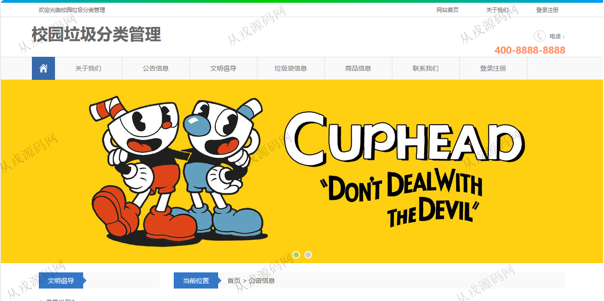
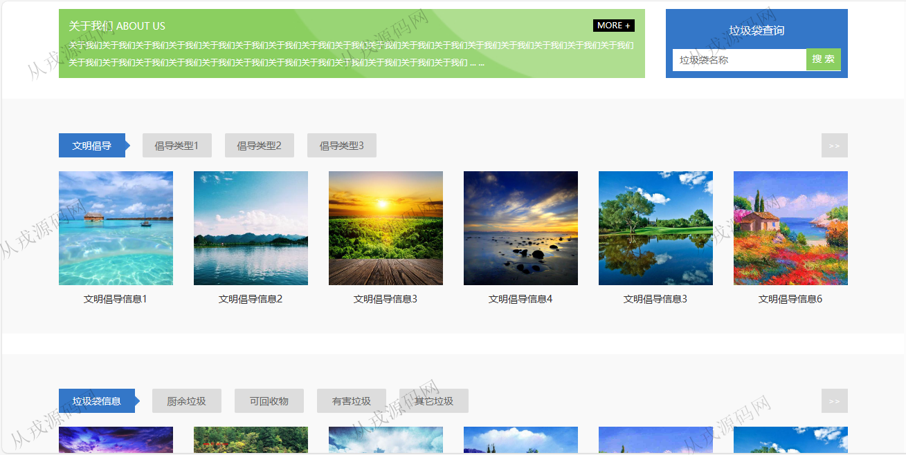
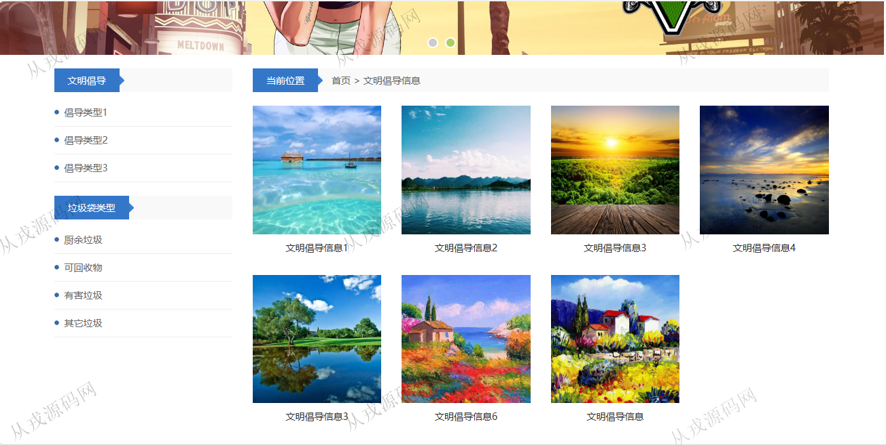
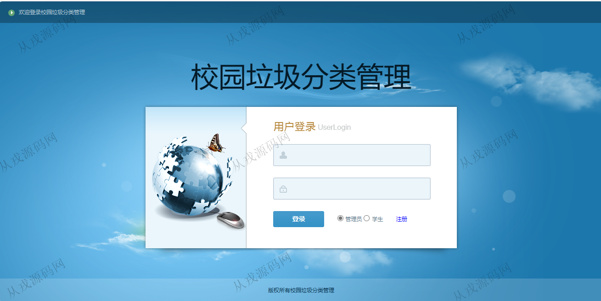
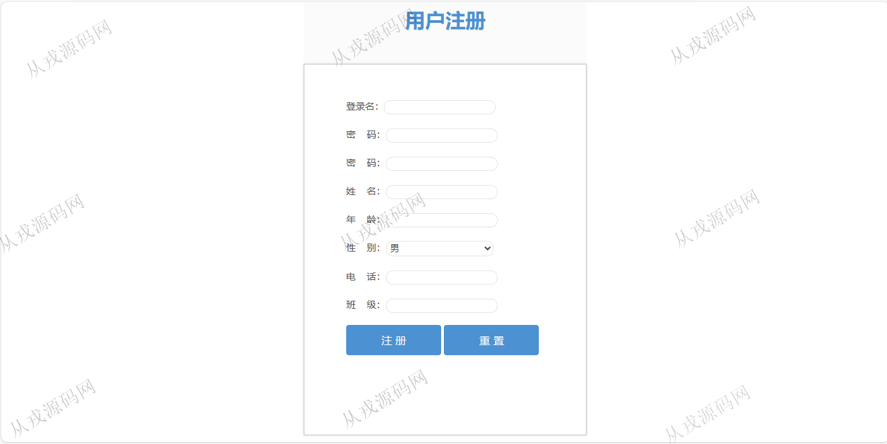
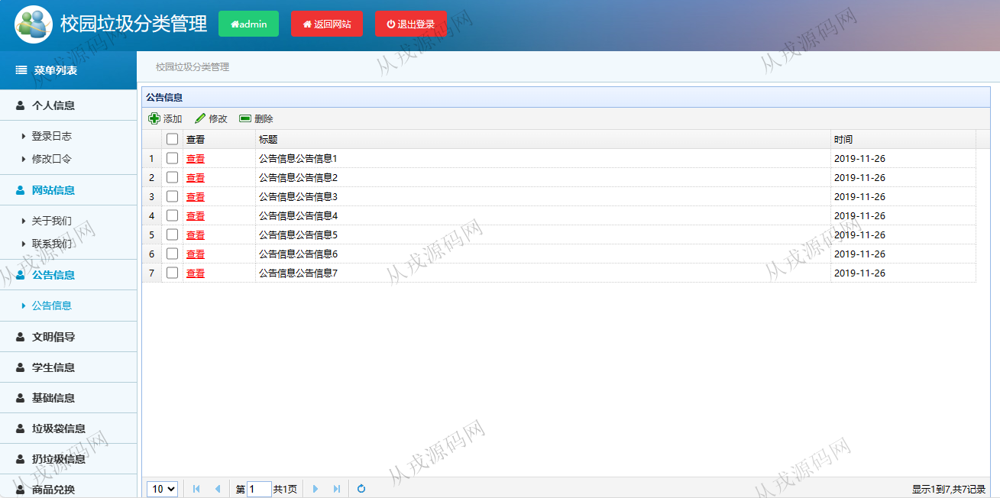
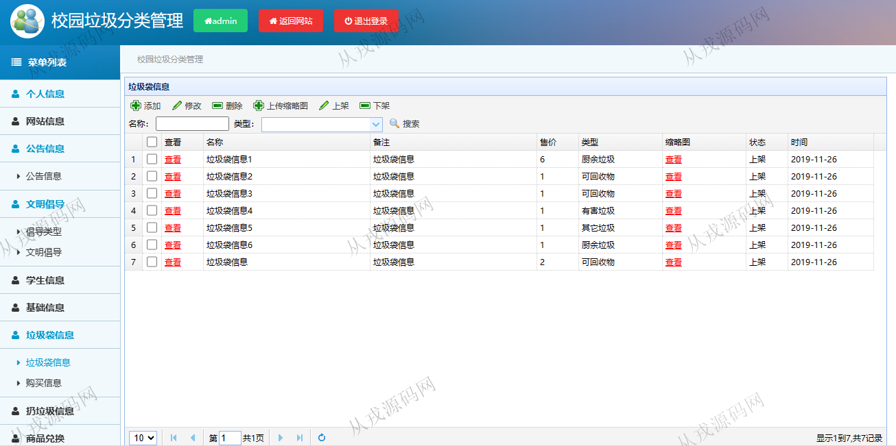
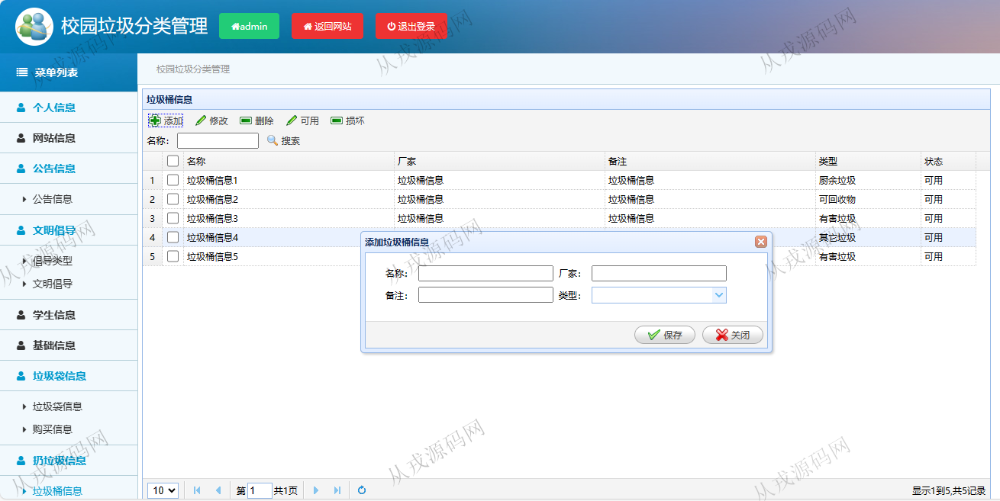
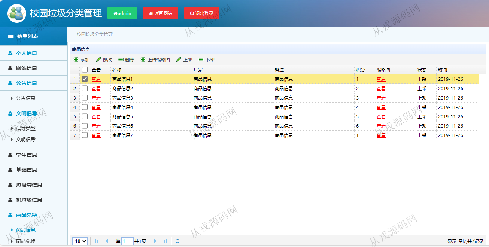

<h1 align="center">100.校园垃圾分类管理系统</h1>

- <b>完整代码获取地址：从戎源码网 ([https://armycodes.com/](https://armycodes.com/))</b>
- <b>技术探讨、资料分享，请加QQ群：692619798</b> 
- <b>作者微信：19941326836  QQ：952045282</b> 
- <b>承接计算机毕业设计、Java毕业设计、Python毕业设计、深度学习、机器学习</b>
- <b>选题+开题报告+任务书+程序定制+安装调试+论文+答辩ppt 一条龙服务</b>
- <b>所有选题地址 ([https://github.com/YuLin-Coder/AllProjectCatalog](https://github.com/YuLin-Coder/AllProjectCatalog)) </b>

## 项目介绍
基于ssm的校园垃圾分类管理系统：前端 jsp、jquery、easyui，后端 springmvc、spring、mybatis，角色分为管理员、学生；集成文明倡导、垃圾袋信息、商品信息、商品兑换等功能于一体的系统。

## 功能介绍

### 学生

- 基本功能：登录、注册、退出
- 网站首页：主导航栏，轮播图，垃圾袋搜索查询，文明倡导，垃圾袋信息、商品信息
- 公告信息：公告分类展示，公告详情
- 文明倡导：分类导航，文明倡导详情
- 垃圾袋信息：分类导航，垃圾袋详情，在线订购
- 商品信息：商品分类展示，商品详情，在线兑换
- 会员中心：个人信息查看与修改，密码修改，创意信息的增删改查，垃圾分类，垃圾袋购买信息，扔垃圾信息，商品兑换列表

### 管理员

- 个人信息：个人信息查看与修改，密码修改
- 网站信息：关于我们，联系我们内容修改和维护
- 公告信息：公告信息的增删改查
- 文明倡导：倡导类型，文明倡导信息的增删改查，上传缩略图，上传视频
- 学生信息：学生信息列表查询，创业类型的增删改查，创意信息的列表查询
- 基础信息：垃圾袋类型的增删改查
- 垃圾袋信息：垃圾袋信息的增删改查，上架，下架，购买垃圾袋列表查询
- 垃圾桶信息：垃圾桶信息的增删改查，可用，损坏状态标识
- 扔垃圾信息：分类扔垃圾列表查询，关键词搜索
- 商品信息：商品信息的增删改查，上架，下架
- 商品兑换：学生兑换商品的列表查询

## 环境

- <b>IntelliJ IDEA 2021.3</b>

- <b>Mysql 5.7.26</b>

- <b>Tomcat 7.0.73</b>

- <b>JDK 1.8</b>

## 运行截图

